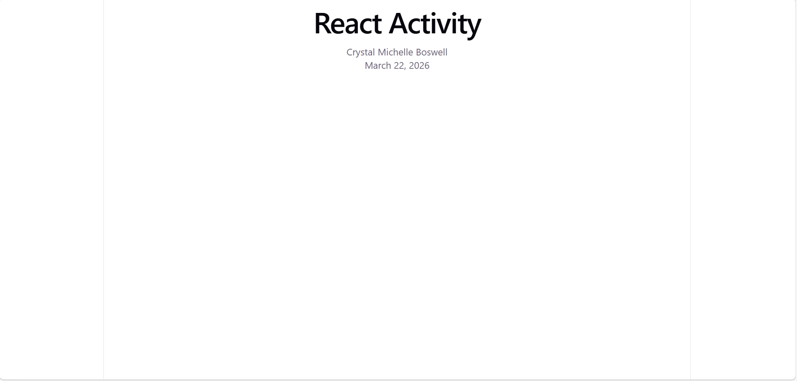

# 🚀 React Activity Project

This is a simple React application created using Vite.

## 📌 Project Description
This project displays:
- Activity title
- Student name
- Current date

## 🛠️ Technologies Used
- React
- Vite
- JavaScript
- HTML

## ▶️ How to Run the Project

1. Open terminal  
2. Navigate to project folder:
   ```
   cd my-app
   ```
3. Install dependencies:
   ```
   npm install
   ```
4. Start development server:
   ```
   npm run dev
   ```
5. Open browser at:
   ```
   http://localhost:5173/
   ```

## 📷 Screenshot



---

## 👤 Author
Crystal Michelle Boswell

